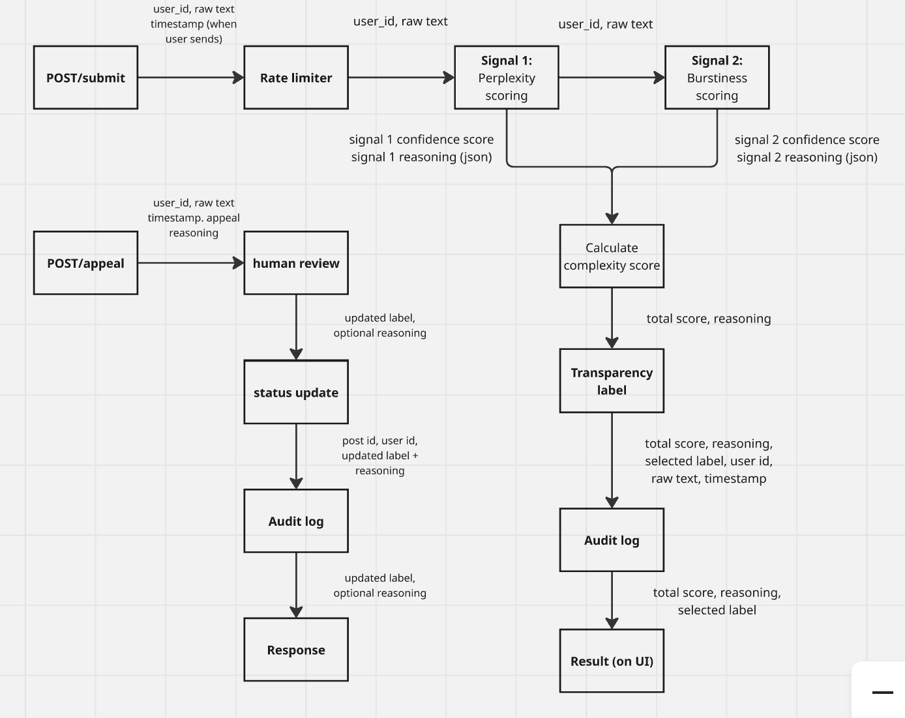
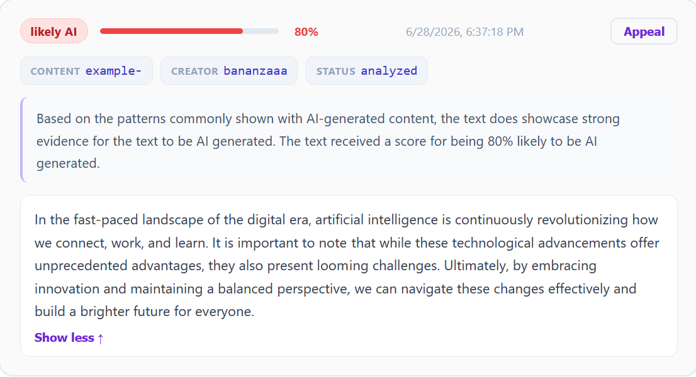
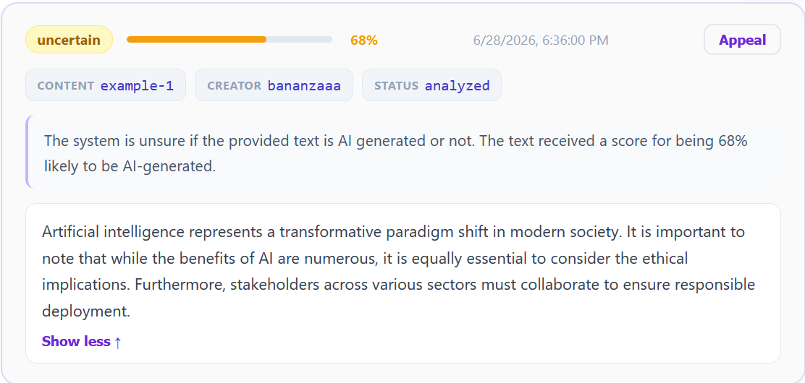
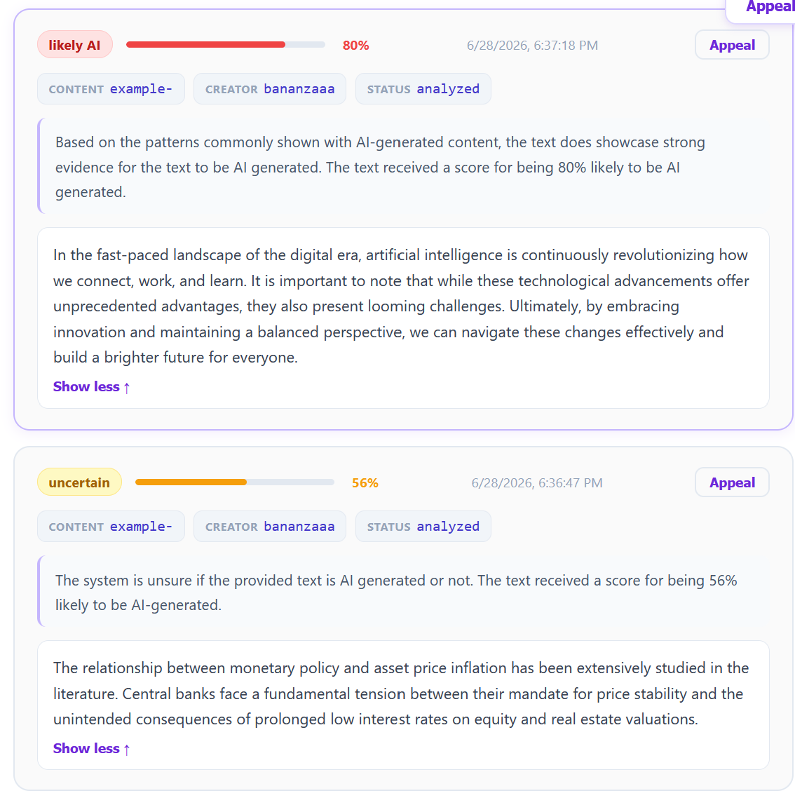
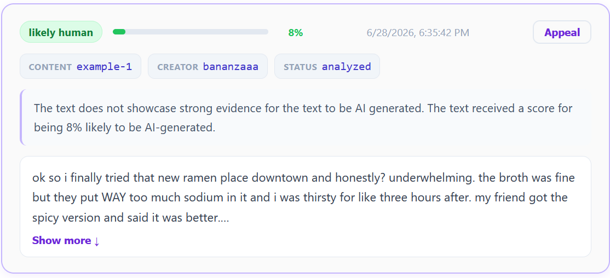
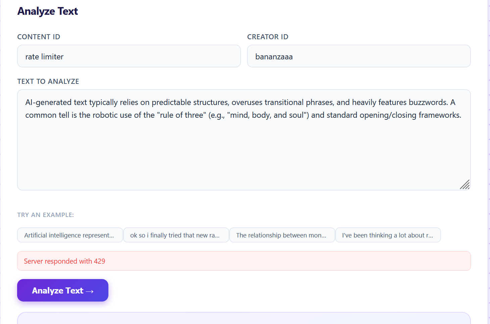

# ai201-project4-provenance-guard
Demo: https://youtu.be/G4Gyx8Vkt9g

## Architecture overview
> the path a submission takes from input to transparency label

## Detection signals
> what each signal measures, why you chose it, and what it misses

### 1. Perplexity (predictability of text)

#### What does this measure?
Perplexity aims to measure the variation of word choice of the text. Human text generally makes use of a wider range of vocabulary and variation in text than AI-generated text. 

It is important to note that humans can also write in a more formal, predictable style, which may recieve a lower perplexity score while AI-generated text that is edited by human text may recieve a lower score. 

It will look for
* likelihood of word choice. 
* typos and misspellings
* unusual or unexpected word sequences

#### Output
The output will be a single score that encompasses all of these variables from 0-1 (as representation of % of likelihood of matching AI generated text's perplexity, where 1 is highest confidence of AI generated text.)

### 2. Burstiness (variation in writing)

#### What does this measure?

Human text typically has uneven written patterns in comparision to AI-generated text, which are reliant on patterns to form dentences.

AI models typically have some algorithmic and predictable way to write text, leading to low burstiness. Human text typically has more variation in the way they write, thus leading to a higher burstiness. 

It's important to note that this score may incorrectly classify human writing that is written in a standardize style, such as academic writing. The score may also be manipulated by human manipulation of AI generated text.

Burstiness will measure for variation in the following:

* sentence length
* paragraph length
* sentence structure
* word usage

#### Output
The output will be a single score that encompasses all of these variables from 0-1 (as representation of % of likelihood of matching AI generated text's burstiness, where 1 is highest confidence of AI generated text.)

## Confidence scoring
> how you combined signals into a score, how you validated it's meaningful, and **two example submissions with noticeably different confidence scores** (one high-confidence, one lower-confidence) showing the actual scores

The final score will be calculated using the previous two scores and the following equation:

$$
(perplexity\ score * 0.5) + (burst\ score * 0.5) = final\ confidence\ score
$$

This formula is used to give equal weight between the two umbrella / detection signals for identifying confidence in AI generated text.

* Scores closer to 1 will lead to a higher likelihood that the text is AI generated.
* Scores closer to 0 will signify text with a higher likelihood that the text is written by humans, the inverse of the likelihood the text is AI generated.

| Score threshold | Label        |
| --------------- | ------------ |
| 0 - 0.35        | likely human |
| 0.36 - 0.70     | uncertain    |
| 0.71 - 1        | likely AI    |

### Example 1

### Example 2

## Transparency label
> typed description of all three variants (high-confidence AI, human, uncertain) showing the exact text each one displays; screenshot or mockup optional

| Label | Resulting text |
| ----- | -------------- |
| likely human | The text does not showcase strong evidence for the text to be AI generated. The text recieved a score for being <score> % likely to be AI-generated. |
| uncertain | The system is unsure if the provided text is AI generated or not. The text recieved a score for being <score> % likely to be AI-generated. |
| likely AI | Based on the patterns commonly shown with AI-generated content, the text does showcase strong evidence for the text to be AI generated. The text recieved a score for being <score> % likely to be AI generated. | 

## Rate limiting
> the limits you chose and your reasoning for those specific values

I chose to limit the `POST/submit` limit to 1 per 5 seconds, 10/min, and 100/day. 

I chose these limits as I wanted to make sure users are intentional with what they are submitting to the prompt. I chose this limit to ensure there isn't too much spam submitted to the database, which at worst case scenarios can overwhelm the system during an attack. Since the code isn't hosted, I don't need to worry about users concurrently using the same server also. Using 1 per 5 seconds will help limit accidental duplicate entries, as removing entries from the database isn't possible in the current iteration of the app.

## Known limitations
> at least one specific type of content your system would likely misclassify and why

The system struggles to misclassify formal writing, such as academic and legal documents. This style of human writing typically follows a consistent style which may trigger the perplexity scores and burstiness scores to raise (to be closer to think it is AI generated). This is caused as these writing styles typically follow a more consistent structure style and vocabulary usage, which is what the system looks for when determining if a document is AI-generated or not.

## Spec reflection
> one way the spec helped you, one way implementation diverged from it and why

The spec really helped me with setting up Flask, which is a framework I wasn't used to. I also had very minimal experience setting up API endpoints, so following the tutorial provided by the spec helped me a ton to better understand how to write these endpoints. Setting up the endpoints led to a lot of debugging my system, so being able to use the provided code to ensure the endpoint exists made me more confident that my code works. Overall, I became a lot more comfortable with how to write them in Flask and hope the skill is transferrable to other frameworks like Django. 

One diversion I made from the spec is running the cURL commands. I had a lot of issues in regards to be able to run cURL, so I asked Claude to convert these commands to use `Invoke-WebRequest`. In hindsight, I should have set it up through WSL. I also added a couple of columns to the database to allow the APIs to send more data, especially  the raw text, around to provide better context to human reviewers when it comes to appeals.

## AI usage section
> at least 2 specific instances describing what you directed the AI to do and what you revised or overrode

1. I used Claude to help build the frontend of my system. I gave it a list of user inputs to build a form, alongside the database schema and API endpoints to build the form. I further prompted to change the database view from a table to individual list items to better view the text and make it more friendly to make appeals and not overwhelm the user with a ton of information at once.

2. I used Claude to help write my prompts used to help score the text. I gave the AI my planning.md sections for each detection signals. I tested with text from the specification, and saw that the code was scoring the code incorrectly. I changed the prompt to better define the scoring guideline to better fit my planning.md and score distribution. Additionally, I changed the way the output was defined since there was an issue with the generated code where the score would always return 0, I was more explicit to return a number relevant to the score between 0 and 1.
